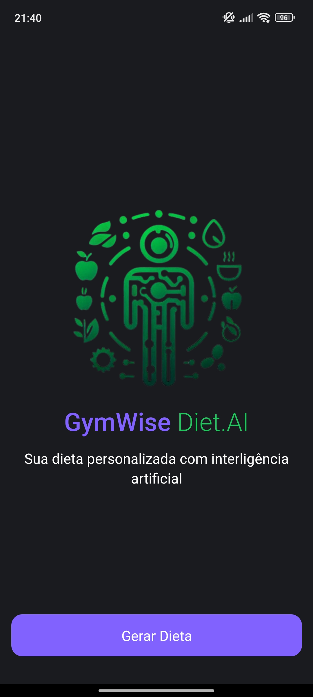
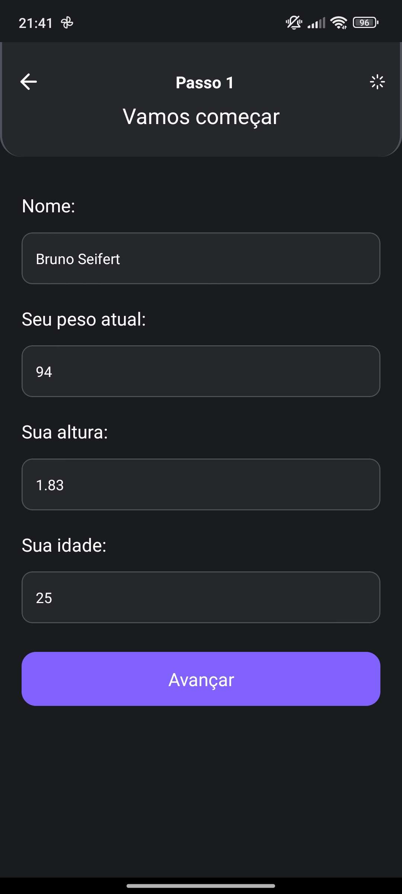
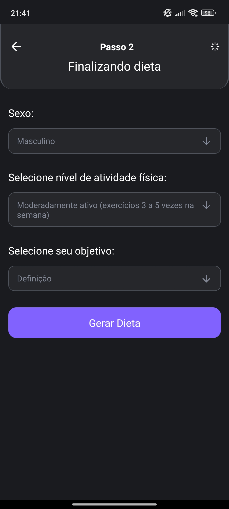

# GymWise DietAI

## Sobre
GymWise DietAI é um aplicativo desenvolvido para gerar recomendações de dietas utilizando inteligência artificial. O aplicativo fornece sugestões personalizadas para ajudar os usuários a alcançar seus objetivos de saúde e bem-estar.

## Tecnologias Utilizadas
- React Native
- Expo
- NativeWind


## Imagens do Aplicativo
<div style="display: flex; justify-content: space-between;">
  
  
  
  
</div>

## Backend
Para rodar a aplicação, você pode acessar o backend aqui: [Link para o Backend](https://github.com/brunoseifert/backend-dietAI).

## Instalação
Para instalar e executar o projeto, siga os passos abaixo:

1. Clone o repositório:
   ```bash
   git clone https://github.com/seu-usuario/GymWise-DietAI.git
   cd GymWise-DietAI
